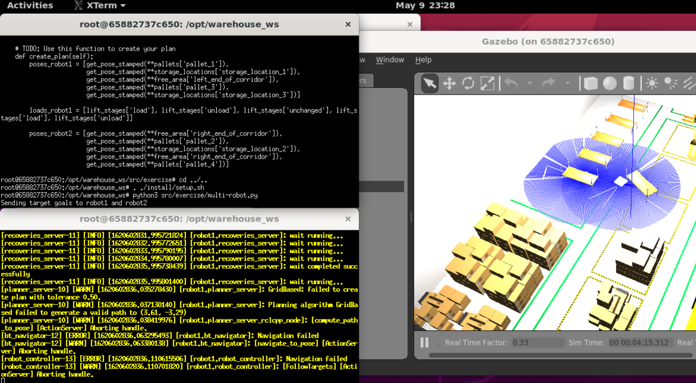

# Report
**Group 17**: Akash Harikrishnan (ah5431), Mukund Vijayaraghavan (mv2167) and Robby Siu (rs7046)

This is the **task 4 markdown report** where we explain progress on all tasks, providing results and how to improve on it.

Invite link to Trello board: https://trello.com/invite/b/WgtxnEOZ/17865c4137c78451ebdf922b00274c32/collaborative-robotics-project

Link to board: https://trello.com/b/WgtxnEOZ

**LINK to exercise folder**: https://github.com/mknd7/CustomRobots/tree/group17-multirobot/amazon_robot/exercise

## Task 1 - Steps taken to complete setup:

- Tried natively with Windows first
  - Used Docker to work with provided image but the resultant setup was very slow and unusable.
- [success] Used **AWS Robomaker**

  We chose **c4.2xlarge** instances for the **ROS2 Foxy** environment.

  - Tried setup from scratch, without Docker, installing Nav2 and other dependencies. We succesfully installed all missing dependencies, but could not proceed without a certain BondCpp package. This caused 3 other dependencies to be unable to work.
  - [success] Used **Docker** with image provided from the exercise to succesfully bring up the environment.

We added Docker to the allowed connections in the ACL, and when we needed the terminal inside the container, we used `docker exec -it <pID> bash`.

## Task 2 - Planner:

- Fixed the location of the robots using the 2D Pose Estimate in RViz.

- Running the project:

- Due to time constraints, we were not able to implement the planner such that the robots do not collide or wander without purpose. The frame rate being low also hindered progress.
- We read about action clients and servers, and were planning to use these common servers: compute_path_to_pose, spin, wait, etc.
- We removed the test plan and assigned initial positions for the robots and pallets.
- We defined the delivery locations and the pickup locations.
- We defined the actions between the respective positions (load, unload)

## Task 3 - PDDL

We created a new planner, improving upon the existing example planner, and added the required predicates and actions (planner.pddl).

Again, due to time constraints, we were unable to integrate with Plansys2 and Nav2, and thus also unable to build the behaviour trees required. However, we wrote the Plansys2 commands that should have been used (in [exercise](https://github.com/mknd7/CustomRobots/tree/group17-multirobot/amazon_robot/exercise) folder).

The predicates we used are:
- `adjacent`
- `atl` (at location)
- `loaded`
- `unloaded`
- `in` (pallet in location?)
- `in-delivery-zone` (location in zone?)
- `in-pickup-zone` (location in zone?)

The actions we used are:
- `move`
- `load`
- `unload`
- `avoid-collision`

## Conclusion

This project was a good learning experience, working through the initial setup issues to writing the PDDL planner. Overall, we completed tasks 1, 3 (no integration) and 4, with task 2 incomplete due to the bulk of the time taken in task 1's setup.
